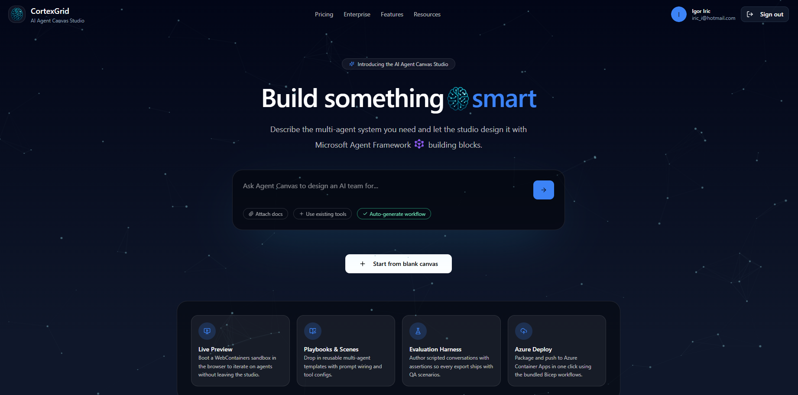
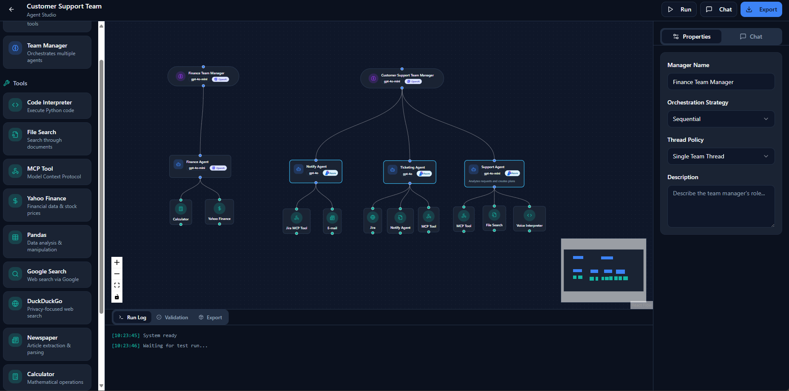
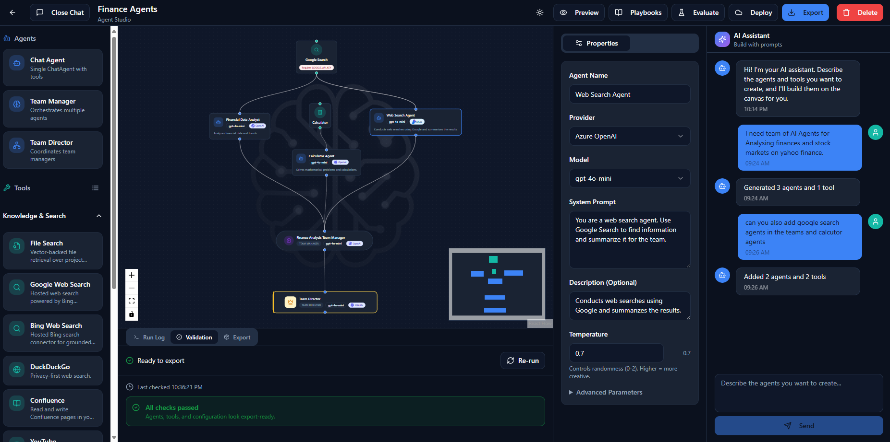
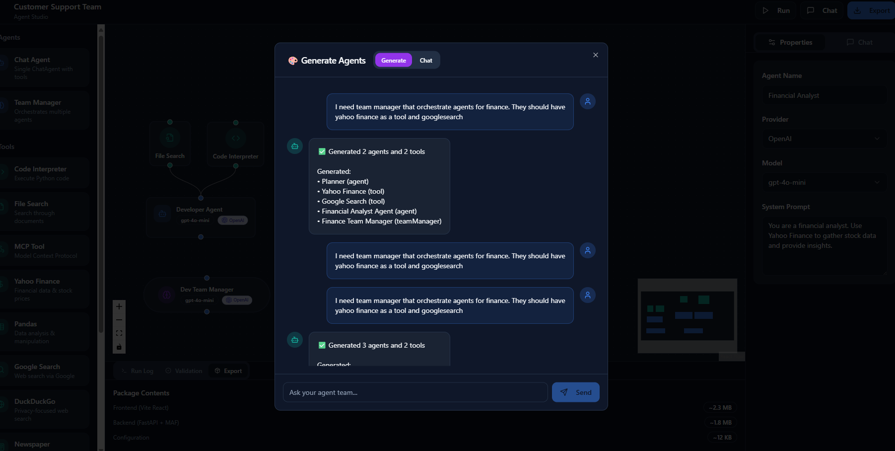
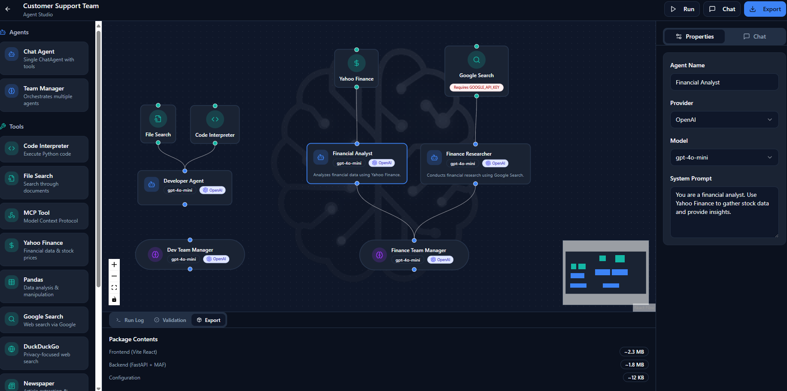
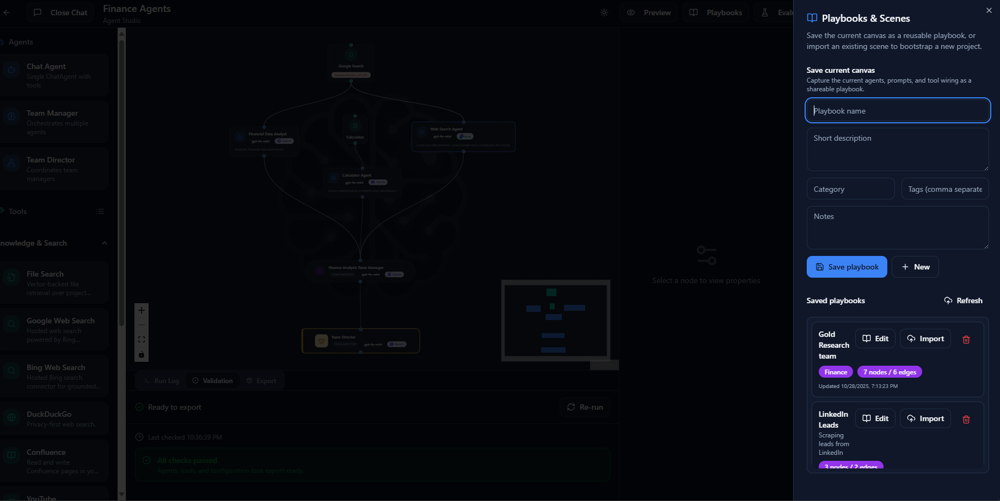
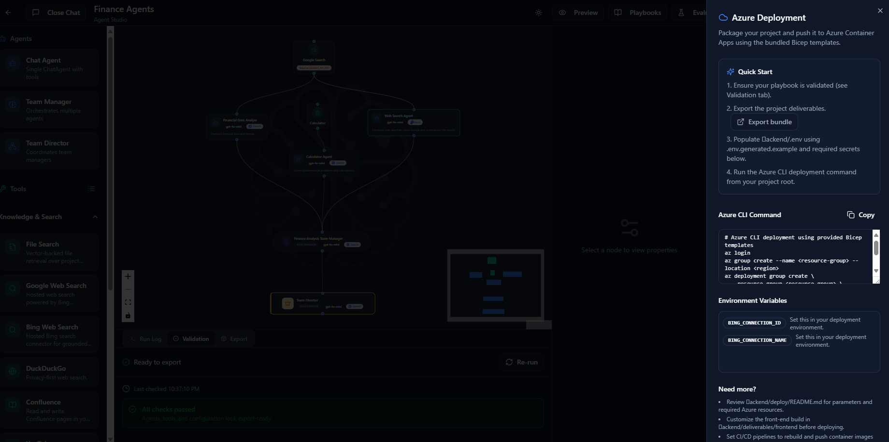

# Agent Canvas

Visual builder for Microsoft Agent Framework (MAF) solutions

Agent Canvas helps teams describe, prototype, evaluate, and export multi-agent systems that run on the Microsoft Agent Framework. Start from a Lovable-inspired landing page, prompt an initial design, refine it on the canvas, and ship a paired FastAPI backend + React frontend deliverable.


---

## Highlights
- **Prompt-to-canvas flow** - capture a product brief on the landing page and jump straight into the studio with the chat already seeded.

- **Document-grounded prompts** - attach docs or images, pick existing tools, and hand off context-aware instructions to the generator.
- **Drag-and-drop authoring** - compose agents, team managers, and function/MCP tools with validation tailored to the export pipeline.

- **Live Preview sandbox** - spin up a WebContainers backend in the browser to smoke-test flows without leaving the workspace.
- **Playbooks & scenes** - save reusable multi-agent templates with placeholder slots and load them into new projects.

- **Evaluation harness** - define scripted conversations with assertions; exported bundles now include the QA suite.
- **Azure deploy button** - generate a ready-to-run CLI script that uses the bundled Bicep templates for Container Apps deployment.

- **Supabase-backed auth & persistence** - sign in with GitHub, Microsoft Entra (Azure AD), or email magic links to sync projects and scenarios.

---

## Quick start

### Prerequisites
- Node.js 18+
- npm 9+
- Python 3.11+ with `pip` (or Poetry/uv) for the backend

### 1. Install dependencies
```bash
# Frontend
npm install

# Backend (from repo root)
pip install -r backend/requirements.txt
```

### 2. Configure environment
Copy `.env.example` to `.env` and adjust the values you need. At minimum the frontend expects the backend URL:
```bash
cp .env.example .env
```
`VITE_API_URL` should point to the FastAPI server (defaults to `http://localhost:8000`).  

If you want hosted auth & persistence, add your Supabase project keys:
```
VITE_SUPABASE_URL=https://<project>.supabase.co
VITE_SUPABASE_ANON_KEY=...
```
See [Supabase schema](#supabase-schema) for the table layout Agent Canvas expects.

### 3. Run the services
```bash
# Terminal 1 – backend
uvicorn backend.app.main:app --reload --port 8000

# Terminal 2 – frontend
npm run dev
```
Visit http://localhost:5173 to open the new landing page.

---

## Supabase schema
The optional persistence layer uses two tables:

```sql
create table public.projects (
  id uuid primary key,
  user_id uuid not null,
  name text not null,
  project_json jsonb not null,
  thumbnail_url text,
  updated_at timestamptz default now()
);

create table public.evaluation_scenarios (
  id uuid primary key,
  user_id uuid not null,
  name text not null,
  scenario_json jsonb not null,
  updated_at timestamptz default now()
);

create table public.project_messages (
  id uuid primary key,
  project_id uuid not null,
  user_id uuid not null,
  role text not null check (role in ('user', 'assistant', 'system')),
  content text not null,
  metadata jsonb,
  created_at timestamptz default now()
);

create index on public.project_messages (project_id, created_at);
```

Enable GitHub and Microsoft providers in Supabase Authentication, and make sure your site's redirect URL includes the local dev origin (e.g. `http://localhost:5173`).

If Supabase variables are not supplied the studio falls back to local storage – projects and scenarios work offline, but sign-in options are hidden.

---

## Key workflows

### Landing → Studio handoff
1. Enter a natural-language brief on the home page.
2. Agent Canvas creates a fresh project ID and opens `/studio/:id?prompt=`.
3. The Chat panel consumes the prompt automatically, triggering graph generation.

### Canvas authoring
- Palette offers agents, team managers, hosted tools, and MCP connectors.
- Canvas sanitises nodes/edges so exports pass validation (`kind`, `name`, `toolConfig`, etc.).
- Build Bar surfaces live validation issues before you export.

### Live preview
- Open **Preview** to boot a WebContainers sandboxed backend in-browser.
- Syncs the current `project.json` and allows quick smoke tests without hitting your local FastAPI server.

### Playbooks and scenes
- Save/load reusable agent templates with metadata.
- Importing a playbook replaces the current graph and keeps the project name in sync.

### Evaluation harness
- Define scenarios (prompt + assertions) in the **Evaluate** drawer.
- Scenarios persist via Supabase and are bundled into `backend-python/tests/scenarios.json` on export.
- Run scenarios locally to get pass/fail feedback before packaging.

### Azure deploy
- The **Deploy** drawer assembles an `az` CLI script using the included Bicep templates.
- Surface required secrets after export via the generated `.env.generated.example` file.

---

## Export deliverable
`Export` packages:
- `backend-python/` – FastAPI server with Microsoft Agent Framework integration.
- `frontend/` – ready-to-serve React client.
- `project.json` – canonical graph definition (agents/tools/edges).
- `tools_manifest.json` – inferred tool implementations, plus `.env.generated.example` for secrets guidance.
- `tests/scenarios.json` – evaluation harness scenarios (when defined).

---

## Contributing
Issues and pull requests are welcome. Helpful contributions include:
- New Microsoft Agent Framework tool adapters.
- Canvas UX and validation improvements.
- Additional playbook templates and evaluation scenarios.

Please lint before submitting (`npm run lint`) and describe any schema or environment changes in the PR.

---

MIT License © 2025 Igor Iric / CortexGrid
